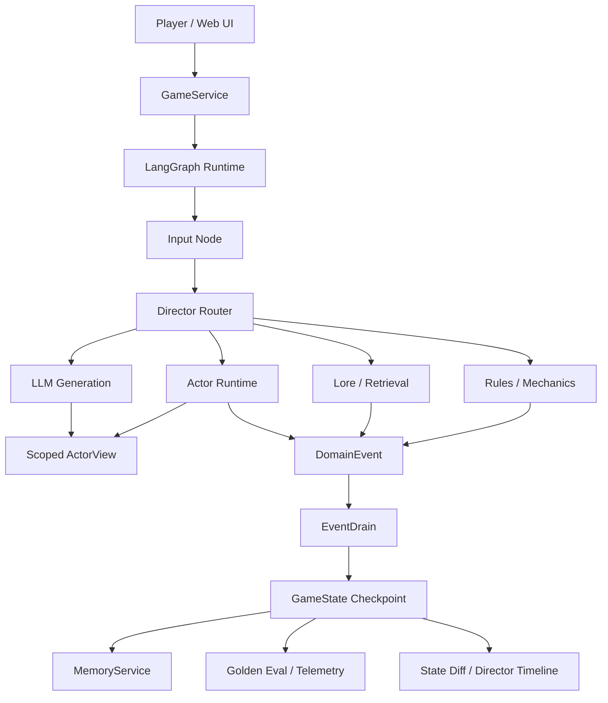

# Controlled Agent Sim Runtime

A controlled multi-agent simulation runtime where LLM agents perceive scoped world state, make decisions, and express intent while deterministic systems own state mutation, replay, and safety boundaries.

This repository is packaged as an AI agent infrastructure portfolio project. The playable Hazard Lab scenario is intentionally compact: games provide inspectable simulations with hidden state, agent-specific perception, memory, delegated actions, and consequences that can be tested end to end.

## Why This Exists

LLM agents are useful only when they cannot silently corrupt critical state. This project separates:

- **LLMs** for intent interpretation, agent expression, and open-ended dialogue.
- **Deterministic systems** for movement, checks, inventory, memory writes, world flags, damage, and final state commits.
- **Typed events** for all state mutation through `DomainEvent` and `EventDrain`.
- **Actor-scoped views** so each agent receives only authorized world state.
- **Golden replay evals** to keep agent behavior, visibility, and event application regression-testable.

## System Highlights

- **Scoped perception:** `ActorView` filters flags, environment objects, peer state, visible history, and private memory before an agent can respond.
- **State safety boundary:** LLM output can propose intent and speech, but authoritative changes land through deterministic event handlers.
- **Multi-agent runtime:** Scout, Analyst, and Tactician carry different agendas, memories, and risk models instead of acting as one generic assistant voice.
- **Replayable evals:** YAML golden cases validate routing, memory isolation, item transfer, hazard handling, and scenario outcomes without live model calls.
- **Performance visibility:** benchmark tooling compares graph-routed scoped prompts against a naive full-state agent baseline.
- **Operator-facing UI:** the browser demo shows map state, agent barks, dice/check feedback, state diffs, and a Director Timeline.

## Demo Scenario

Hazard Lab is a vertical slice for controlled agent behavior:

1. The team wakes in a sealed facility.
2. Scout detects a hidden gas trap through actor-specific perception.
3. The player delegates disarm/lock/open actions to agents.
4. Analyst interprets lab notes and updates shared knowledge.
5. The team confronts the Gatekeeper, whose response changes if earlier evidence was discovered.
6. Final escape requires a key transfer committed through deterministic events.

The scenario is deliberately small. Its purpose is to demonstrate system architecture, not game content volume.

## Architecture



## Quick Start

```bash
pip install -r requirements.txt
python server.py
```

Open:

```text
http://127.0.0.1:8000/web_ui/?map_id=hazard_lab
```

For a clean recording session:

```text
http://127.0.0.1:8000/web_ui/?session_id=portfolio_demo_001&map_id=hazard_lab&qa_no_idle=1
```

## Tests And Evals

```bash
pytest -q
python -m core.eval.runner --suite golden
make check
```

Benchmark dry run:

```bash
python scripts/generate_benchmark.py --dry-run --max-cases 4
```

Real LLM benchmark:

```bash
python scripts/generate_benchmark.py --max-cases 4
```

## Repository Map

```text
core/application/      GameService orchestration boundary
core/graph/            LangGraph state machine, nodes, and routing
core/actors/           ActorView, ActorRuntime, registry, visibility contracts
core/events/           DomainEvent models, apply path, event store
core/memory/           Memory scopes, retrieval, distillation, service layer
core/systems/          dice, mechanics, world init, pathfinding, inventory
core/eval/             Golden replay runner, assertions, telemetry, reports
evals/golden/          deterministic regression cases
evals/benchmark/       real LLM benchmark cases
web_ui/                browser demo and Director Timeline
docs/                  public architecture and demo notes
```

## Portfolio Positioning

This is not a model-training project and not a full game. It is a working agent infrastructure prototype focused on bounded autonomy: agent perception, memory isolation, deterministic state commits, replayable evaluation, and observable runtime behavior.
